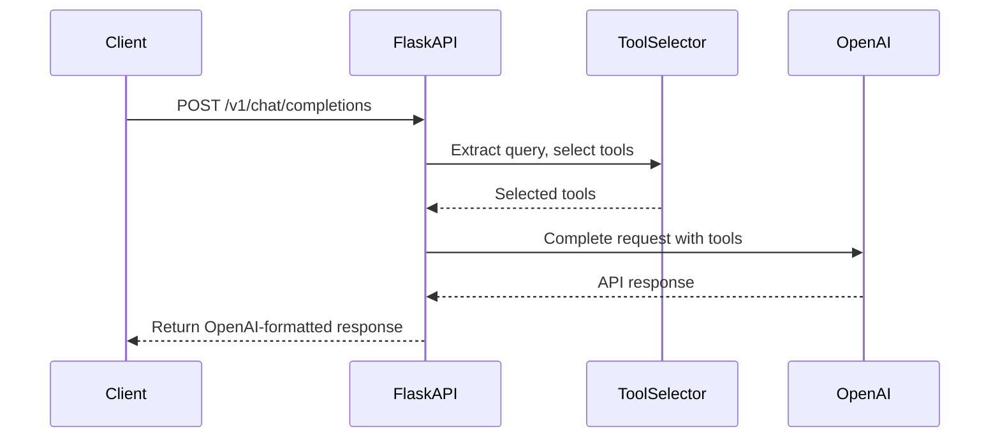

### Key Features:

1. **OpenAI-Compatible API**
   * Endpoint: `POST /v1/chat/completions`
   * Accepts identical request format as OpenAI API
   * Returns identical response structure as OpenAI SDK
2. **Tool Selection Integration**
   * Automatic tool selection based on last user message
   * Preserves all original request parameters
   * Adds `tools` and `tool_choice` parameters dynamically
3. **Configuration**

   | Environment Variable | Default                     | Description                   |
   | -------------------- | --------------------------- | ----------------------------- |
   | `OPENAI_API_KEY`     | Required                    | Your OpenAI API key           |
   | `OPENAI_BASE_URL`    | `https://api.openai.com/v1` | API base URL                  |
   | `EMBEDDING_MODEL`    | `text-embedding-3-small`    | Tool selector model           |
   | `TOOL_THRESHOLD`     | `0.65`                      | Semantic similarity threshold |
   | `PORT`               | `5000`                      | Service port                  |
4. **Sample Request**

```
POST /v1/chat/completions
{
  "model": "gpt-4-turbo",
  "messages": [
    {"role": "system", "content": "You are a helpful assistant"},
    {"role": "user", "content": "What's Apple's stock price on NASDAQ for the last week?"}
  ]
}
```

5. **Sample Response**

```
{
  "id": "chatcmpl-8e0b2c7f",
  "object": "chat.completion",
  "created": 1717744911,
  "model": "gpt-4-turbo",
  "choices": [
    {
      "index": 0,
      "message": {
        "role": "assistant",
        "content": null,
        "tool_calls": [
          {
            "id": "call_CB94Hk0c",
            "type": "function",
            "function": {
              "name": "get_financial_data",
              "arguments": "{\"symbol\":\"AAPL\",\"exchange\":\"NASDAQ\",\"period\":\"1w\"}"
            }
          }
        ]
      },
      "finish_reason": "tool_calls"
    }
  ],
  "usage": {
    "prompt_tokens": 85,
    "completion_tokens": 22,
    "total_tokens": 107
  }
}
```

### Deployment Options:

**1. Direct Execution**

```
export OPENAI_API_KEY=your_api_key
python app.py
```

**2. Docker**

```
# Dockerfile
FROM python:3.10-slim
WORKDIR /app
COPY . .
RUN pip install flask openai retrieval-tool-selector
CMD ["python", "app.py"]
```

Build and run:

```
docker build -t semantic-tool-api .
docker run -p 5000:5000 -e OPENAI_API_KEY=your_key semantic-tool-api
```

**3. Test with curl**

```
curl http://localhost:5000/v1/chat/completions \
  -H "Content-Type: application/json" \
  -H "Authorization: Bearer your_api_key" \
  -d '{
    "model": "gpt-4-turbo",
    "messages": [
      {"role": "user", "content": "What is the weather in Paris tomorrow in Celsius?"}
    ]
  }'
```

### Architectural Flow:



This implementation provides:

1. Full compatibility with OpenAI API specification
2. Automatic semantic tool selection
3. Parameter preservation in requests
4. Response format identical to OpenAI SDK
5. Easy integration with existing OpenAI clients
6. Container-ready deployment
7. Debug mode for troubleshooting
8. Proper error handling following OpenAI standards

The service seamlessly fits into existing OpenAI workflows while adding the semantic tool selection capability.
